# Build Guide

Step-by-step Vivado flow to get this design running on a KR260. Each step
below has a placeholder for a screenshot — drop your image into
`docs/images/` under the filename shown and it'll render in place.

## 1. Create the project

*File → New Project → project name and location*

*New Project wizard → Project Type → RTL Project*

*New Project wizard → Add Sources — left empty here and skipped with
**Next**; the actual `rtl/` and `board/` files get added afterward, in
[Step 2](#2-add-design-sources).*

Target part: **`xck26-sfvc784-2LV-c`** (the Kria K26 SOM used on the KR260).

## 2. Add design sources

*Add Source Files → selecting everything in `rtl/`*

*New Project wizard → Add Sources, with the selected files and their
Location confirmed*

`board/top_kr260_riscv.sv` lives in a different folder than the `rtl/`
files, so it doesn't get picked up by that same file browse — add it as a
second pass, from the Project Manager after the project exists:

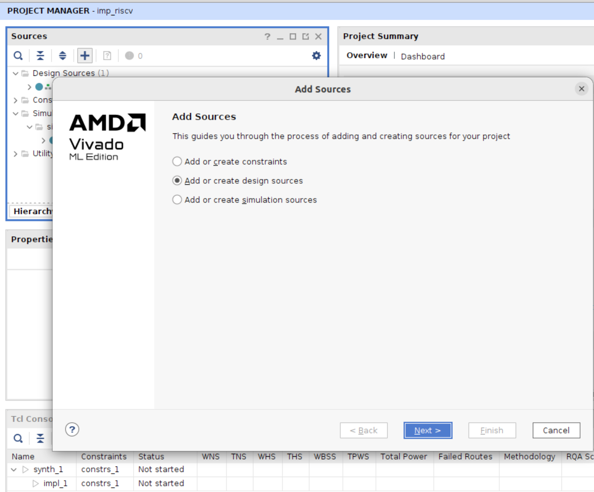
*Sources panel → `+` → **Add or create design sources***

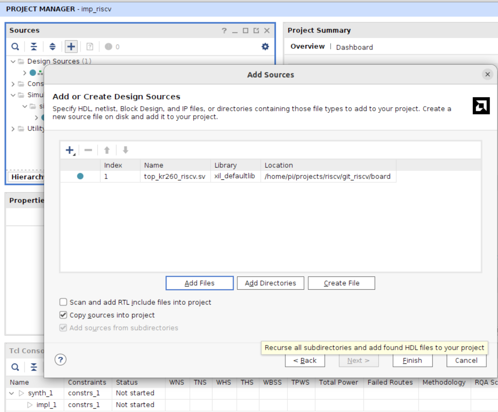
*`top_kr260_riscv.sv` added from `git_riscv/board/`*

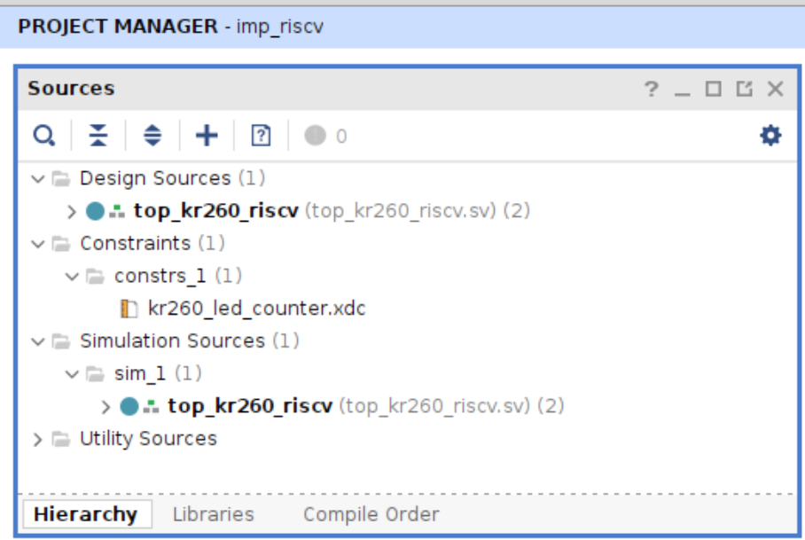
*Sources panel afterward — `top_kr260_riscv` at the top of Design Sources
with its instantiated modules nested underneath (confirms `top.sv` was
found and elaborated correctly), plus the constraint file and a matching
entry under Simulation Sources.*

Add everything under `rtl/` plus `board/top_kr260_riscv.sv` as design
sources.

> **Watch the file type.** Vivado sometimes adds `.sv` files as plain
> Verilog instead of SystemVerilog, which produces confusing errors like
> `'logic' is an unknown type` or `syntax error near '@'` on files that are
> otherwise correct. Check **Source Node Properties → File Type** for each
> file and set it to **SystemVerilog** if needed. See
> [Troubleshooting](Troubleshooting.md).

## 3. Add constraints

*New Project wizard → Add Constraint Files → `kr260_led_counter.xdc` selected*

*New Project wizard → Default Part → **Boards** tab, searched "kr260" →
**Kria KR260 Robotics Starter Kit SOM**. Picking the board this way selects
the underlying part (`xck26-sfvc784-2LV-c`) for you.*

Add `constraints/kr260_led_counter.xdc`. It constrains:
- `clk` → `PACKAGE_PIN C3`, `LVCMOS18`, 25 MHz (`create_clock -period 40.000`)
- `led_out[0]`/`led_out[1]` → `PACKAGE_PIN F8` / `E8`, `LVCMOS18`

> The port names in the XDC **must exactly match** the port names in
> `top_kr260_riscv.sv` (`led_out`, not `led`). A mismatch causes
> `set_property`/`get_ports` to silently match nothing, which shows up much
> later as `[DRC NSTD-1]`/`[DRC UCIO-1]` unconstrained-pin errors at bitstream
> generation. See [Troubleshooting](Troubleshooting.md).

## 4. Run a behavioral simulation

Before touching hardware, it's worth confirming the design behaves
correctly in simulation — a bad program or an RTL bug is far faster to spot
on a waveform than on the ILA after a full synthesis/implementation cycle.

### Add the memory file

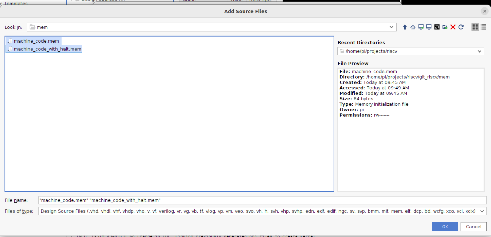
*Add Source Files → `git_riscv/mem/` → both `machine_code.mem` and
`machine_code_with_halt.mem` selected*

`instruction_memory.sv` loads its ROM with
`$readmemh("machine_code.mem", mem)`, and the simulator needs to find that
file by that relative name from wherever it runs — the same requirement
covered in [Loading Programs](Loading-Programs.md) for the hardware build.
Add `mem/machine_code.mem` under **Simulation Sources** (Sources panel →
`+` → **Add or create simulation sources**) so the behavioral simulator can
locate it, rather than relying on it being copied in as a side effect.

### Add the testbench

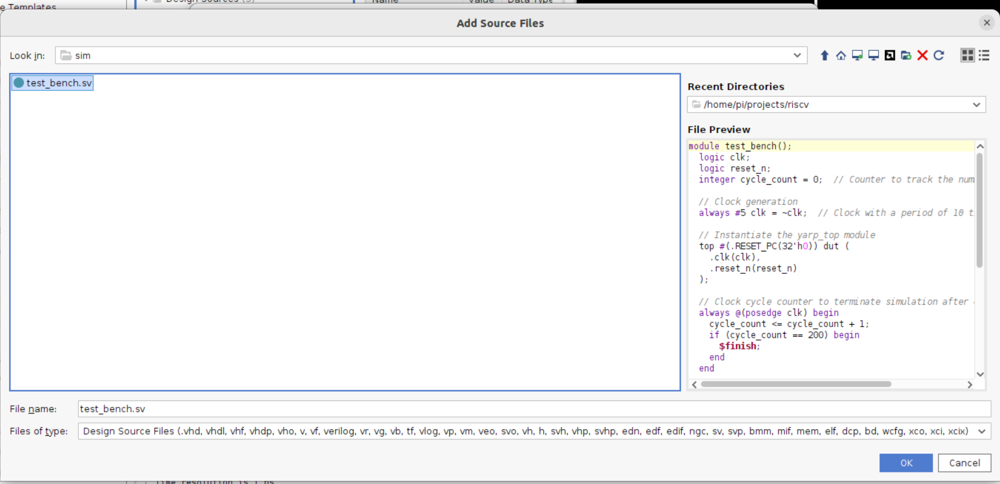
*Add Source Files → `git_riscv/sim/` → `test_bench.sv` selected*

The memory file alone isn't enough to simulate anything — `top_kr260_riscv`
has no self-contained stimulus, since its clock and `reset_n` normally come
from the board's oscillator and the `vio_0` IP, neither of which exist in
simulation. `sim/test_bench.sv` fills that gap:

- instantiates `top` **directly** (not `top_kr260_riscv` — it bypasses the
  board wrapper and its VIO entirely)
- generates its own free-running `clk` (10 time-unit period) and its own
  `reset_n` pulse (asserted low for the first 10 time units)
- automatically stops the simulation with `$finish` after 200 clock cycles

Add it via Sources panel → `+` → **Add or create simulation sources** →
`git_riscv/sim/test_bench.sv`.

> **Set the simulation top.** With `test_bench` now alongside
> `top_kr260_riscv` in Simulation Sources, Vivado needs to simulate
> `test_bench` — not the board wrapper. Right-click `test_bench` in the
> Sources hierarchy (under `sim_1`) and choose **Set as Top**.

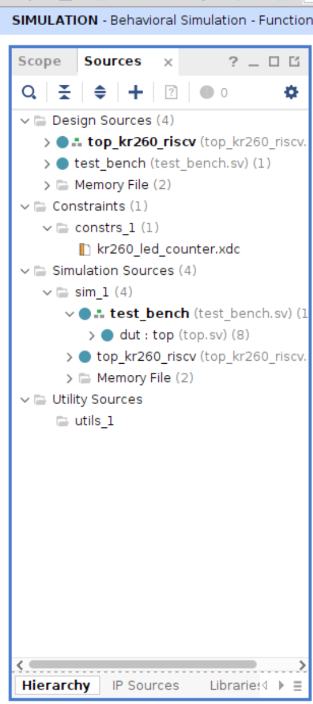
*Sources panel, Hierarchy view, mid-simulation — under **Simulation
Sources → sim_1**, `test_bench` is now the top entry with `dut : top
(top.sv)` correctly nested underneath it, confirming the testbench (not
`top_kr260_riscv`) is what's being simulated.*

### (Optional) Exclude `top_kr260_riscv` from the Simulation Sources view

`top_kr260_riscv` still shows up under **Simulation Sources → sim_1**
alongside `test_bench` — Vivado automatically shares every Design Source
into every fileset, including simulation, whether or not it's actually
instantiated there. Since `test_bench` instantiates `top` directly and
never touches `top_kr260_riscv`, this is harmless clutter rather than a
correctness problem, but it can be tidied up:

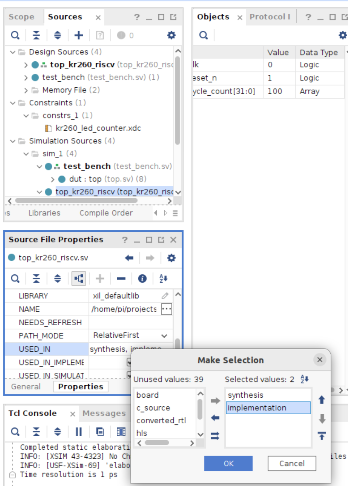
*Select `top_kr260_riscv.sv` → **Source File Properties → Properties** tab
→ **USED_IN** → the **Make Selection** dialog. Move **simulation** out of
the "Selected values" list, leaving only **synthesis** and
**implementation**.*

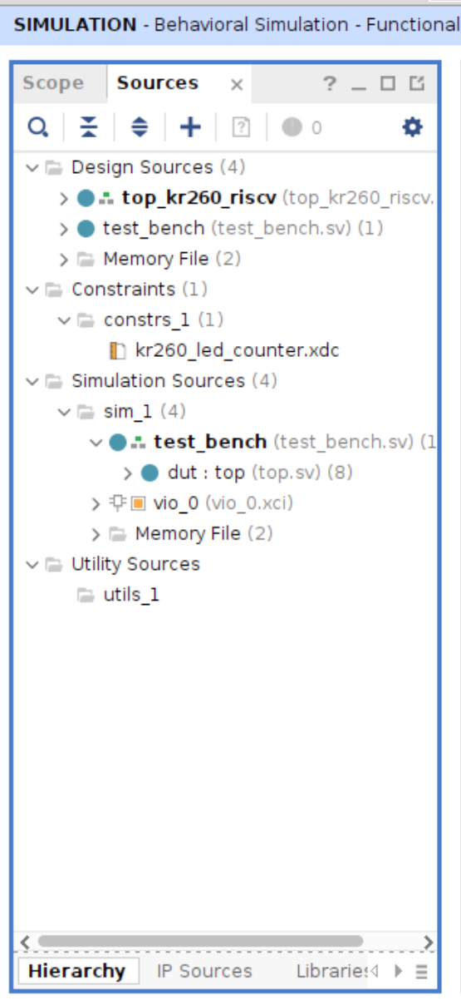
*Click **OK** to apply, then re-open the Sources panel (shown here mid-run,
title bar reading **SIMULATION - Behavioral Simulation - Functional**).
Under **Simulation Sources → sim_1**, `top_kr260_riscv` is gone —
`test_bench` (top) with `dut : top (top.sv)` nested underneath, `vio_0
(vio_0.xci)`, and the memory file are all that's left. `top_kr260_riscv.sv`
itself stays fully active for Steps 6–7 (Synthesis/Implementation) under
**Design Sources**; only its presence in the simulation fileset was
removed.*

### Run the simulation

*Screenshot placeholder — Flow Navigator → SIMULATION → Run Simulation →
Run Behavioral Simulation*

### Check the waveform

*Screenshot placeholder — simulator waveform, confirming `pc`/`instruction`
advance and the register file updates as expected*

See [Loading Programs](Loading-Programs.md) for what the shipped test
program should do, and what to look for on the waveform to confirm it ran
correctly, before moving on to the actual FPGA build below.

## 5. Create the reset/run VIO

`top_kr260_riscv.sv` instantiates a Vivado IP named `vio_0`, customized
with:
- **0 input probes**
- **1 output probe** (`probe_out0`), driving the core's `reset_n`

A VIO output probe defaults to `0` at power-up, so the core sits held in
reset (halted at `RESET_PC`) the moment the bitstream is programmed, until
you explicitly drive the probe to `1` from the Hardware Manager. This gives
you a free run/halt control with no extra logic.

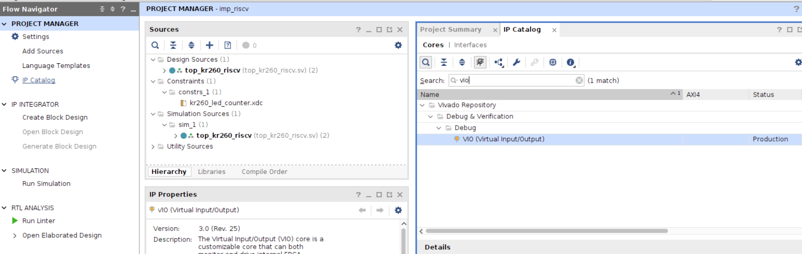
*Flow Navigator → **IP Catalog** → search "vio" → **VIO (Virtual
Input/Output)** under Debug & Verification → Debug*

Double-click it to open **Customize IP**.

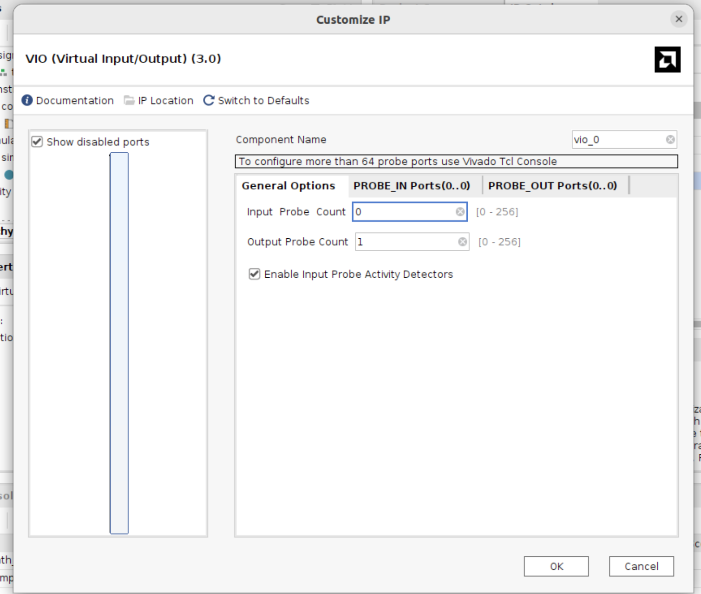
*Customize IP → General Options. Component Name **must** be `vio_0` (to
match the instantiation in `top_kr260_riscv.sv`). Leave **Output Probe
Count** at `1`, but change **Input Probe Count from its default down to
`0`** — this build only drives `reset_n` out of the VIO, it doesn't feed
anything back in. Click OK once both are set.*

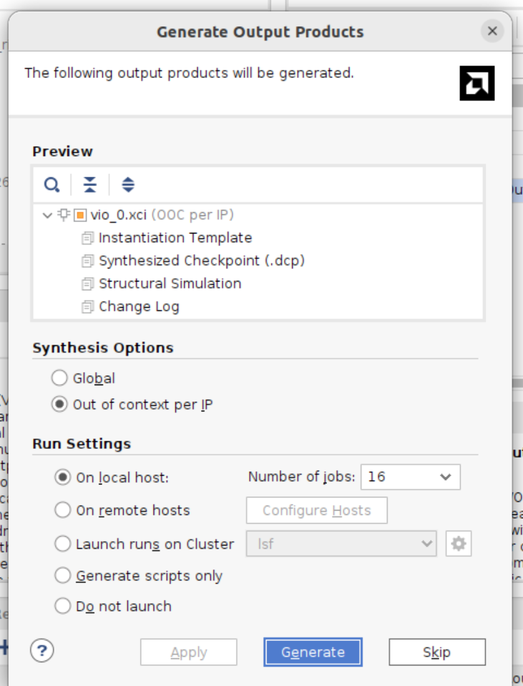
*Generate Output Products dialog → **Generate**. This kicks off an
out-of-context synthesis run for just the VIO core.*

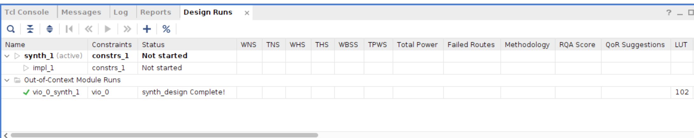
*Design Runs tab → **wait for `vio_0_synth_1` to show "synth_design
Complete!"** before moving on. This runs in the background — don't start
the main Synthesis run (Step 6) until this finishes, or Vivado won't have a
usable `vio_0` to elaborate against.*

## 6. Synthesize and set up debug

*Screenshot placeholder — Flow Navigator: Run Synthesis*

*Screenshot placeholder — Set Up Debug wizard, signal selection*

1. Run **Synthesis**.
2. **Tools → Set Up Debug**, and select the signals you want visible on the
   ILA — at minimum the `(* mark_debug = "true" *)` signals already in
   `top.sv` (`pc`, `instruction`, `opcode`, `rd_addr`, `wr_data`, `rf_wr_en`,
   `alu_res`, `branch_taken`, and the register-file taps `dbg_x1`/`dbg_x2`/
   `dbg_x3`). See [Debug Workflow](Debug-Workflow.md) for what each signal
   tells you and how to add more.
3. Run **Implementation**, then **Generate Bitstream**.

## 7. Program the device

*Screenshot placeholder — Hardware Manager: Program Device*

Open the Hardware Manager, connect to the board's JTAG (`xck26_0`), and
program the generated `.bit` file.

> If Vivado reports something like `[Labtools 27-3421] PL Power Status OFF,
> cannot connect PL TAP`, the FPGA fabric genuinely isn't reachable over
> JTAG yet — this is a board/boot-sequencing issue, not a bitstream problem.
> See [Troubleshooting](Troubleshooting.md).

## 8. Run it

*Screenshot placeholder — ILA waveform + VIO dashboard, core running*

Open the ILA dashboard and the VIO's dashboard. Drive the VIO's
`probe_out0` to `1` to release reset and let the core start executing from
`mem/machine_code.mem`. Watch `pc`/`instruction` advance each cycle, and
`dbg_x1`–`dbg_x3` / the onboard LEDs to confirm the program's effects — see
[Loading Programs](Loading-Programs.md) for what the shipped test program
does.

## Changing the program later

Editing `mem/machine_code.mem` requires re-running **Synthesis** (not just
Implementation) before the change takes effect — `$readmemh` is evaluated
at elaboration time. See [Loading Programs](Loading-Programs.md) and
[Roadmap](Roadmap.md) (a VIO-based loader that avoids this is designed but
not yet built).
