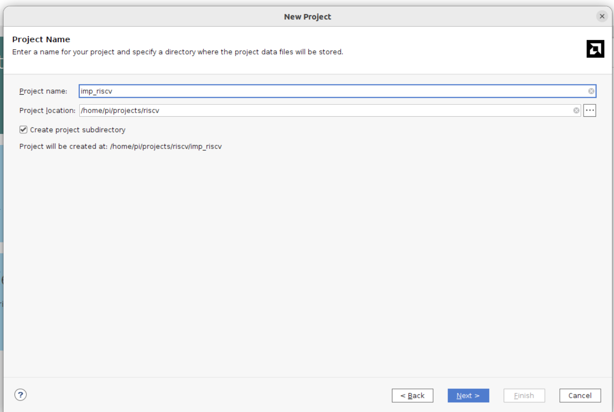
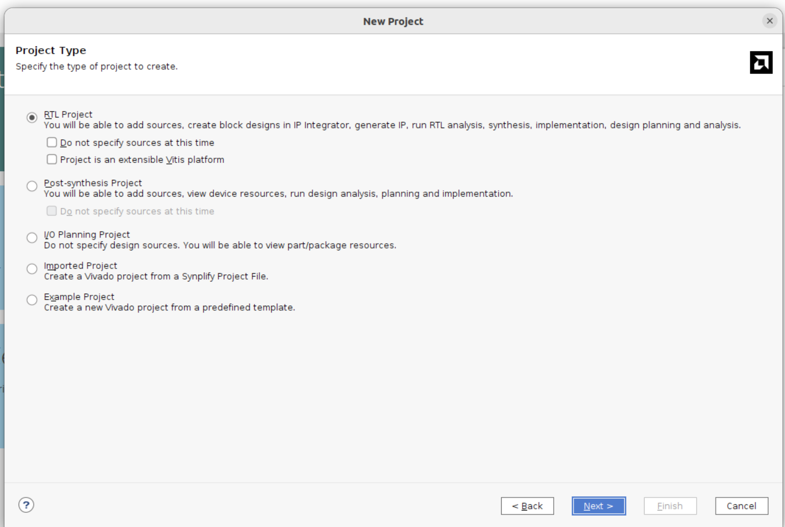
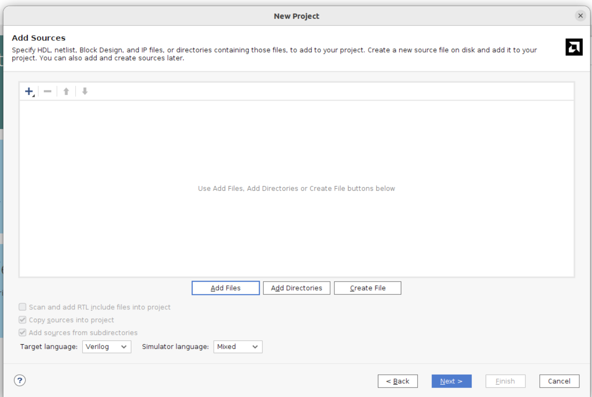
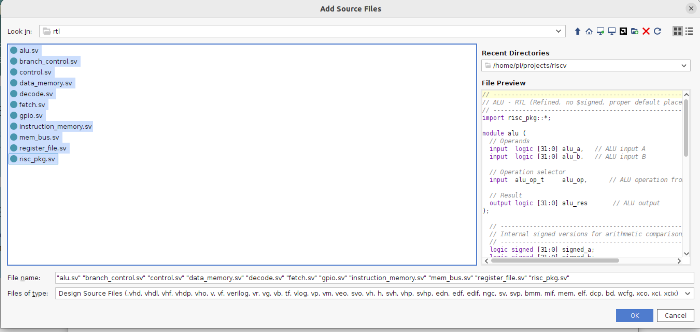
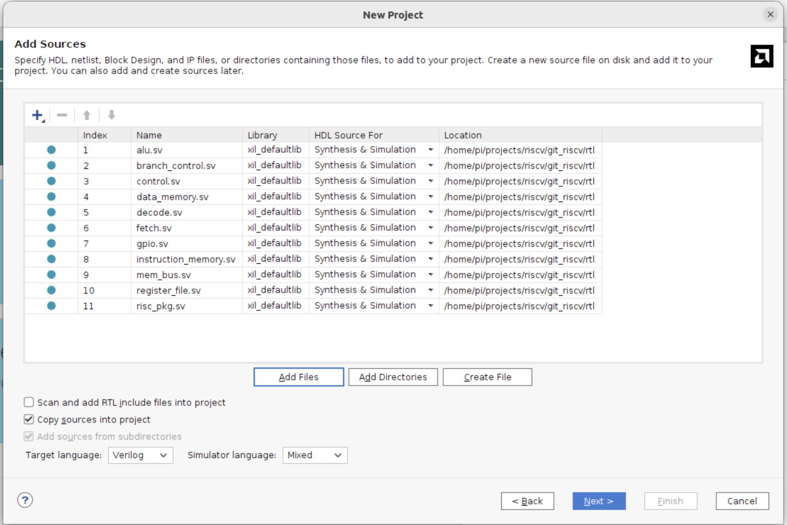
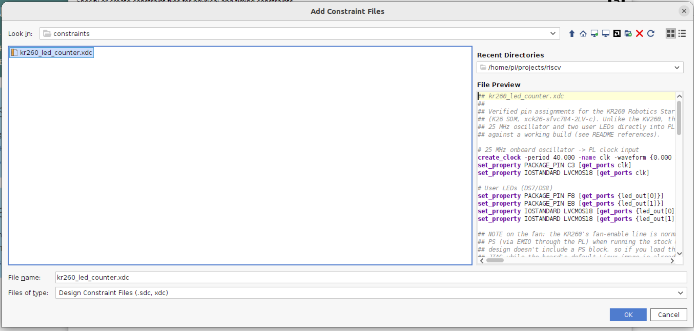
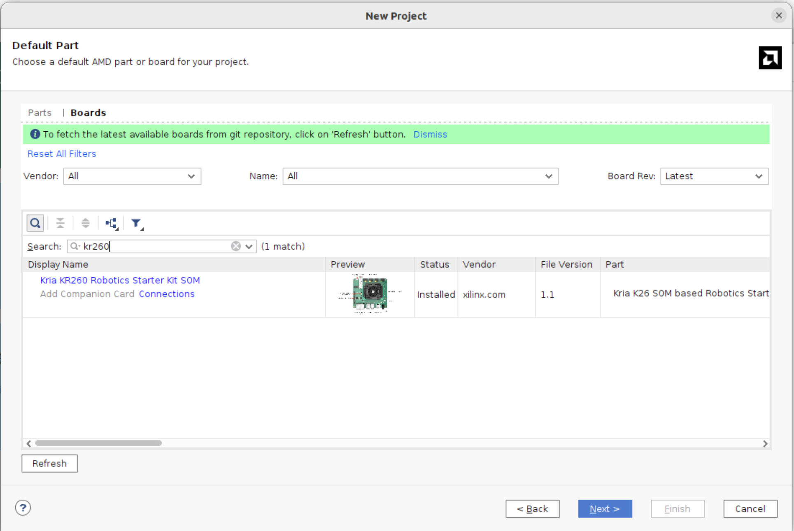

# Build Guide

Step-by-step Vivado flow to get this design running on a KR260. Each step
below has a placeholder for a screenshot — drop your image into
`docs/images/` under the filename shown and it'll render in place.

## 1. Create the project

*File → New Project → project name and location*

*New Project wizard → Project Type → RTL Project*

*New Project wizard → Add Sources — left empty here and skipped with
**Next**; the actual `rtl/` and `board/` files get added afterward, in
[Step 2](#2-add-design-sources).*

Target part: **`xck26-sfvc784-2LV-c`** (the Kria K26 SOM used on the KR260).

## 2. Add design sources

*Add Source Files → selecting everything in `rtl/`*

*New Project wizard → Add Sources, with the selected files and their
Location confirmed*

Add everything under `rtl/` plus `board/top_kr260_riscv.sv` as design
sources.

> **Watch the file type.** Vivado sometimes adds `.sv` files as plain
> Verilog instead of SystemVerilog, which produces confusing errors like
> `'logic' is an unknown type` or `syntax error near '@'` on files that are
> otherwise correct. Check **Source Node Properties → File Type** for each
> file and set it to **SystemVerilog** if needed. See
> [Troubleshooting](Troubleshooting.md).

## 3. Add constraints

*New Project wizard → Add Constraint Files → `kr260_led_counter.xdc` selected*

*New Project wizard → Default Part → **Boards** tab, searched "kr260" →
**Kria KR260 Robotics Starter Kit SOM**. Picking the board this way selects
the underlying part (`xck26-sfvc784-2LV-c`) for you.*

Add `constraints/kr260_led_counter.xdc`. It constrains:
- `clk` → `PACKAGE_PIN C3`, `LVCMOS18`, 25 MHz (`create_clock -period 40.000`)
- `led_out[0]`/`led_out[1]` → `PACKAGE_PIN F8` / `E8`, `LVCMOS18`

> The port names in the XDC **must exactly match** the port names in
> `top_kr260_riscv.sv` (`led_out`, not `led`). A mismatch causes
> `set_property`/`get_ports` to silently match nothing, which shows up much
> later as `[DRC NSTD-1]`/`[DRC UCIO-1]` unconstrained-pin errors at bitstream
> generation. See [Troubleshooting](Troubleshooting.md).

## 4. Create the reset/run VIO

*Screenshot placeholder — IP Catalog: VIO customization (0 in / 1 out)*

`top_kr260_riscv.sv` instantiates a Vivado IP named `vio_0`, customized
with:
- **0 input probes**
- **1 output probe** (`probe_out0`), driving the core's `reset_n`

A VIO output probe defaults to `0` at power-up, so the core sits held in
reset (halted at `RESET_PC`) the moment the bitstream is programmed, until
you explicitly drive the probe to `1` from the Hardware Manager. This gives
you a free run/halt control with no extra logic.

Generate this IP (name it `vio_0` to match the instantiation) before running
synthesis.

## 5. Synthesize and set up debug

*Screenshot placeholder — Flow Navigator: Run Synthesis*

*Screenshot placeholder — Set Up Debug wizard, signal selection*

1. Run **Synthesis**.
2. **Tools → Set Up Debug**, and select the signals you want visible on the
   ILA — at minimum the `(* mark_debug = "true" *)` signals already in
   `top.sv` (`pc`, `instruction`, `opcode`, `rd_addr`, `wr_data`, `rf_wr_en`,
   `alu_res`, `branch_taken`, and the register-file taps `dbg_x1`/`dbg_x2`/
   `dbg_x3`). See [Debug Workflow](Debug-Workflow.md) for what each signal
   tells you and how to add more.
3. Run **Implementation**, then **Generate Bitstream**.

## 6. Program the device

*Screenshot placeholder — Hardware Manager: Program Device*

Open the Hardware Manager, connect to the board's JTAG (`xck26_0`), and
program the generated `.bit` file.

> If Vivado reports something like `[Labtools 27-3421] PL Power Status OFF,
> cannot connect PL TAP`, the FPGA fabric genuinely isn't reachable over
> JTAG yet — this is a board/boot-sequencing issue, not a bitstream problem.
> See [Troubleshooting](Troubleshooting.md).

## 7. Run it

*Screenshot placeholder — ILA waveform + VIO dashboard, core running*

Open the ILA dashboard and the VIO's dashboard. Drive the VIO's
`probe_out0` to `1` to release reset and let the core start executing from
`mem/machine_code.mem`. Watch `pc`/`instruction` advance each cycle, and
`dbg_x1`–`dbg_x3` / the onboard LEDs to confirm the program's effects — see
[Loading Programs](Loading-Programs.md) for what the shipped test program
does.

## Changing the program later

Editing `mem/machine_code.mem` requires re-running **Synthesis** (not just
Implementation) before the change takes effect — `$readmemh` is evaluated
at elaboration time. See [Loading Programs](Loading-Programs.md) and
[Roadmap](Roadmap.md) (a VIO-based loader that avoids this is designed but
not yet built).
